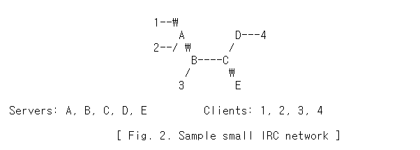
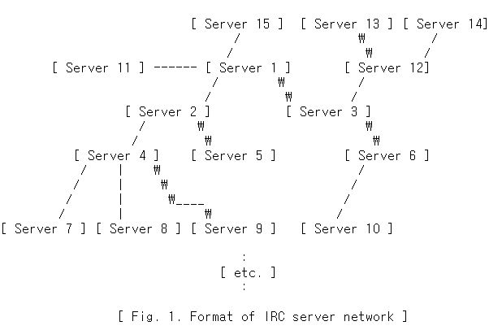

# RFC 1459 번역본

- `Status of This Memo`
    
    이 메모는 인터넷 커뮤니티를 위한 실험 프로토콜을 정의합니다.
    
    개선을 위한 논의와 제안이 필요합니다.
    
    이 프로토콜의 표준화 상태 및 상태는 "IAB 공식 프로토콜 표준" 최신판을 참조하십시오.
    
    이 메모의 배포는 무제한입니다.
    
- `Abstract`
    
    IRC 프로토콜은 BBS 상의 사용자들이 그들끼리 채팅할 수 있는 수단으로 처음 구현된 이후 지난 4년 동안 개발되었습니다. 이제 전 세계 서버 및 클라이언트 네트워크를 지원하며 성장에 대처하기 위해 노력하고 있습니다.
    
    지난 2년 동안 주 IRC 네트워크에 연결된 평균 사용자 수는 10배 증가했습니다.
    
    IRC 프로토콜은 가장 단순한 클라이언트를 가진 텍스트 기반 프로토콜입니다.
    
    서버에 연결할 수 있는 소켓 프로그램입니다.
    
- `Table of Contents`
    - 1.`INTRODUCTION`
        
        **1.1 Servers**
        
        **1.2 Clients**
        
        **1.2.1 Operator**
        
        **1.3 Channels**
        
        **1.3.1 Channels Operaotors**
        
    - 2.`THE IRC SPECIFICATION`
        
        **2.1 Overview**
        
        **2.2 Character codes**
        
        **2.3 Messages**
        
        **2.3.1 Message format in 'pseudo' BNF**
        
        **2.4 Numeric replies**
        
    - 3.`IRC Concepts`
        
        **3.1 One-to-one communication**
        
        **3.2 One-to-many**
        
        **3.2.1 To a list**
        
        **3.2.2 To a group (channel)**
        
        **3.2.3 To a host/server mask**
        
        **3.3 One to all**
        
        **3.3.1 Client to Client**
        
        **3.3.2 Clients to Server**
        
        **3.3.3 Server to Server**
        
    - 4.`MESSAGE DETAILS`
        
        **4.1 Connection Registration**
        
        **4.1.1 Password message**
        
        **4.1.2 Nickname message**
        
        **4.1.3 User message**
        
        **4.1.4 Server message**
        
        **4.1.5 Operator message**
        
        **4.1.6 Quit message**
        
        **4.1.7 Server Quit message**
        
        **4.2 Channel operations**
        
        **4.2.1 Join message**
        
        **4.2.2 Part message**
        
        **4.2.3 Mode message**
        
        **4.2.3.1 Channel modes**
        
        **4.2.3.2 User modes**
        
        **4.2.4 Topic message**
        
        **4.2.5 Names message**
        
        **4.2.6 List message**
        
        **4.2.7 Invite message**
        
        **4.2.8 Kick message**
        
        **4.3 Server queries and commands**
        
        **4.3.1 Version message**
        
        **4.3.2 Stats message**
        
        **4.3.3 Links message**
        
        **4.3.4 Time message**
        
        **4.3.5 Connect message**
        
        **4.3.6 Trace message**
        
        **4.3.7 Admin message**
        
        **4.3.8 Info message**
        
        **4.4 Sending messages**
        
        **4.4.1 Private message**
        
        **4.4.2 Notice message**
        
        **4.5 User-based queries**
        
        **4.5.1 Who query**
        
        **4.5.2 Whois query**
        
        **4.5.3 Whowas message**
        
        **4.6 Miscellaneous messages**
        
        **4.6.1 Kill message**
        
        **4.6.2 Ping message**
        
        **4.6.3 Pong message**
        
        **4.6.4 Error message**
        

- 1.**INTRODUCTION**
    
    IRC(Internet Relay Chat) 프로토콜은 텍스트 기반 회의와 함께 사용하기 위해 수년간 설계되어 왔습니다.
    
    이 문서에서는 현재 IRC 프로토콜을 설명합니다.
    
    IRC 프로토콜은 TCP/IP 네트워크 프로토콜을 사용하는 시스템에서 개발되었지만, 이 프로토콜이 작동하는 유일한 영역이라는 요구사항은 없습니다.
    
    IRC 자체는 (클라이언트-서버 모델을 사용하여) 분산된 방식으로 많은 컴퓨터에서 실행하기에 적합한 원격 회의 시스템입니다.
    
    일반적인 설정에는 클라이언트(또는 다른 서버)가 연결할 중앙 지점을 형성하는 단일 프로세스(서버)가 포함되며, 필요한 메시지 배달/다중화 및 기타 기능을 수행합니다.
    
- 1.1Servers
    
    서버는 IRC의 backbone을 형성하여 클라이언트가 서로 통신하기 위해 연결할 수 있는 지점과 다른 서버가 연결할 수 있는 지점을 제공하여 IRC 네트워크를 형성합니다.
    
    IRC 서버에 허용되는 유일한 네트워크 구성은 각 서버가 보는 네트워크의 나머지 부분에 대해 중앙 노드 역할을 하는 스패닝 트리[그림 1 참조]의 네트워크 구성입니다.
    
    
    
- 1.2Clients
    
    클라이언트는 다른 서버가 아닌 서버에 연결하는 모든 것입니다.
    
    각 클라이언트는 최대 9자 길이의 고유한 별명으로 다른 클라이언트와 구별됩니다.
    
    닉네임에서 사용할 수 있는 것과 사용할 수 없는 것에 대해서는 프로토콜 문법 규칙을 참조하십시오.
    
    모든 서버에는 별명 외에도 클라이언트가 실행 중인 호스트의 실제 이름, 해당 호스트에 있는 클라이언트의 사용자 이름 및 클라이언트가 연결된 서버의 모든 클라이언트에 대한 다음 정보가 있어야 합니다.
    
- 1.2.1 Operator
    
    IRC 네트워크 내에서 합리적인 양의 주문이 유지되도록 하기 위해, 특별한 클래스의 클라이언트(운영자)가 네트워크에서 일반적인 유지보수 기능을 수행할 수 있습니다.
    
    운영자에게 부여된 권한은 '위험한' 것으로 간주될 수 있지만, 그럼에도 불구하고 필요합니다.
    
    운영자는 서버 연결 해제 및 재연결과 같은 기본 네트워크 작업을 수행하여 잘못된 네트워크 라우팅을 장기간 사용하지 않도록 해야 합니다.
    
    이러한 필요성을 인식하여, 본 문서에서 논의된 프로토콜은 운영자가 이러한 기능을 수행할 수 있도록만 규정하고 있습니다.
    
    섹션 4.1.7(SQUIT) 및 4.3.5(CONNECT)를 참조하십시오.
    
    운영자의 더 논란이 되는 힘은 '힘' 즉, 연결된 네트워크에서 사용자를 제거할 수 있는 능력입니다.
    
    운영자는 클라이언트와 서버 간의 연결을 닫을 수 있습니다.
    
    이것의 남용은 파괴적이고 짜증나기 때문에 이것의 정당성은 섬세합니다.
    
    이러한 유형의 조치에 대한 자세한 내용은 섹션 4.6.1(KILL)을 참조하십시오.
    
- 1.3Channels
    
    채널은 모두 해당 채널로 주소가 지정된 메시지를 수신할 하나 이상의 클라이언트로 구성된 명명된 그룹입니다.
    
    채널은 첫 번째 클라이언트가 가입할 때 암묵적으로 생성되며, 마지막 클라이언트가 채널을 탈퇴할 때 채널은 더 이상 존재하지 않습니다.
    
    채널이 존재하는 동안 모든 클라이언트는 채널 이름을 사용하여 채널을 참조할 수 있습니다.
    
    채널 이름은 최대 200자의 문자열('&' 또는 '#' 문자로 시작)입니다.
    
    첫 번째 문자가 '&' 또는 '#'이어야 한다는 요구 사항 외에 채널 이름에 대한 유일한 제한 사항은 공백('), 컨트롤 G(^G 또는 ASCII 7) 또는 프로토콜에서 목록 항목 구분자로 사용되는 쉼표(')를 포함할 수 없다는 것입니다.
    
    이 프로토콜에서 허용되는 채널에는 두 가지 유형이 있습니다.
    
    하나는 네트워크에 연결된 모든 서버에 알려진 분산 채널입니다.
    
    이러한 채널은 존재하는 서버의 유일한 클라이언트인 첫 번째 문자로 표시됩니다.
    
    이러한 문자는 선행 '&' 문자로 구분됩니다.
    
    이 두 가지 유형 외에도 개별 채널의 특성을 변경할 수 있는 다양한 채널 모드가 있습니다.
    
    이에 대한 자세한 내용은 섹션 4.2.3(MODE 명령)을 참조하십시오.
    
    새 채널을 생성하거나 기존 채널의 일부가 되려면 사용자가 채널에 가입해야 합니다.
    
    가입하기 전에 채널이 존재하지 않으면 채널이 생성되고 생성 사용자가 채널 운영자가 됩니다.
    
    채널이 이미 존재하는 경우 해당 채널의 JOIN 요청을 수락할지 여부는 채널의 현재 모드에 따라 달라집니다.
    
    예를 들어, 채널이 초대 전용(+i)인 경우 초대된 경우에만 가입할 수 있습니다.
    
    프로토콜의 일부로 사용자는 한 번에 여러 채널의 일부가 될 수 있지만 경험이 많은 사용자와 초보 사용자 모두에게 충분한 채널 10개를 제한하는 것이 좋습니다.
    
    이에 대한 자세한 내용은 섹션 8.13을 참조하십시오.
    
    두 서버 간의 분할로 인해 IRC 네트워크가 분리되는 경우, 각 측의 채널은 분할의 각 측의 서버에 연결된 클라이언트로만 구성되어 분할의 한 쪽에 더 이상 존재하지 않을 수 있습니다.
    
    분할이 해결되면, 연결 서버는 각 채널에 있는 사람과 해당 채널의 모드를 서로 알립니다.
    
    채널이 양쪽에 존재하는 경우, JOIN과 MODE는 포괄적으로 해석되어 새로운 연결의 양쪽이 채널에 있는 클라이언트와 채널에 있는 모드에 대해 합의합니다.
    
- 1.31.Channels Operators
    
    주어진 채널의 채널 연산자("chop" 또는 "chanop"이라고도 함)는 해당 채널을 '소유'하는 것으로 간주됩니다.
    
    이러한 상태를 인식하여 채널 운영자는 채널에서 제어 및 일종의 건전성을 유지할 수 있는 특정 권한을 부여받습니다.
    
    채널 소유자로서, 채널 운영자는 그들의 행동에 대한 이유를 가질 필요가 없습니다. 비록 그들의 행동이 일반적으로 반사회적이거나 다른 방식으로 학대적인 것이라면, IRC 운영자에게 개입을 요청하거나, 사용자가 다른 곳으로 떠나 자신만의 채널을 형성하도록 하는 것이 합리적일 수 있습니다.
    
    채널 운영자만 사용할 수 있는 명령은 다음과 같습니다
    
    KICK - 채널에서 클라이언트를 꺼냅니다.
    
    MODE - 채널의 모드를 변경합니다.
    
    INVITE - 클라이언트를 초대 전용 채널(mode +i)로 초대합니다.
    
    TOPIC - mode +t채널에서 채널 주제를 변경합니다.
    
    채널 연산자는 채널과 연결될 때마다 닉네임 옆에 있는 '@' 기호로 식별됩니다(즉, NAMES, WHO 및 WHOIS 명령에 응답).
    

**[2](https://datatracker.ietf.org/doc/html/rfc1459#section-2). The IRC Specification**

- 2.1Overview
    
    여기에 설명된 프로토콜은 서버 간 및 클라이언트 간 서버 연결에 모두 사용됩니다.
    
    그러나 클라이언트 연결(신뢰할 수 없는 것으로 간주됨)에는 서버 연결보다 더 많은 제한이 있습니다
    
- 2.2Character codes
    
    특정 문자 집합이 지정되지 않았습니다.
    
    이 프로토콜은 8비트로 구성된 코드 세트를 기반으로 하며, 이 코드는 octet을 구성합니다.
    
    각 메시지는 이러한 옥텟의 수에 관계없이 구성될 수 있지만 일부 octet 값은 메시지 구분 기호로 작동하는 제어 코드에 사용됩니다.
    
    8비트 프로토콜에 관계없이 구분 기호와 키워드는 대부분 USASCII terminal and a telnet connection.에서 프로토콜을 사용할 수 있습니다.
    
    IRC의 스칸다나비아 기원 때문에  `{ } |`  문자는 각각 `[ ] \` 문자의 소문자 등가물로 간주됩니다.
    
    이 문제는 두 닉네임의 동일성을 결정할 때 중요한 문제입니다.
    
- 2.3Messages
    
    서버와 클라이언트는 서로 메시지를 보내 응답을 생성하거나 생성하지 않을 수 있습니다.
    
    메시지에 올바른 명령이 포함되어 있는 경우, 이후 절에서 설명한 대로 클라이언트는 지정된 응답을 예상해야 하지만 응답을 계속 기다리는 것은 권장되지 않습니다. 클라이언트 대 서버 통신은 본질적으로 비동기적입니다.
    
    각 IRC 메시지는 접두사(옵션), 명령 및 명령 매개 변수(최대 15개)의 세 가지 주요 부분으로 구성될 수 있습니다.
    
    접두사, 명령 및 모든 매개 변수는 하나 이상의 ASCII 공백 문자(0x20)로 구분됩니다.
    
    접두사의 존재는 단일 선행 ASCII 콜론 문자(':', 0x3b)로 표시되며, 이 문자는 메시지 자체의 첫 번째 문자여야 합니다.
    
    콜론과 접두사 사이에는 공백(whitespace)이 없어야 합니다.
    
    접두사는 메시지의 실제 출처를 나타내기 위해 서버에서 사용됩니다.
    
    메시지에 접두사가 없는 경우, 수신된 연결에서 유래한 것으로 간주됩니다.
    
    클라이언트에서 메시지를 보낼 때 접두사를 사용하면 안 됩니다. 접두사를 사용할 경우 유효한 접두사는 클라이언트와 연결된 등록된 닉네임뿐입니다.
    
    접두사로 식별된 소스를 서버의 내부 데이터베이스에서 찾을 수 없거나, 메시지가 도착한 링크가 아닌 다른 연결에서 소스를 등록한 경우, 서버는 메시지를 자동으로 무시해야 합니다.
    
    명령은 유효한 IRC 명령이거나 ASCII 텍스트로 표시되는 3자리 숫자여야 합니다.
    
    IRC 메시지는 항상 CR-LF(Carrage Return - Line Feed) 쌍으로 종단되는 문자 행이며, 이러한 메시지는 후행 CR-LF를 포함한 모든 문자를 포함하여 512자를 초과하지 않아야 합니다.
    
    따라서 명령 및 해당 매개 변수에 대해 최대 510자를 사용할 수 있습니다.
    
    계속 메시지 라인에 대한 규정은 없습니다.
    
    현재 구현에 대한 자세한 내용은 섹션 7을 참조하십시오
    
- 2.3.1**Message format in 'pseudo' BNF**
    
    프로토콜 메시지는 연속된 octets스트림에서 추출되어야 합니다.
    
    현재 해결책은 CR과 LF라는 두 문자를 메시지 구분자로 지정하는 것입니다.
    
    빈 메시지는 자동으로 무시되므로 메시지 간에 CR-LF 시퀀스를 별도의 문제 없이 사용할 수 있습니다.
    
    추출된 메시지는 구성 요소 <prefix>, <command> 및 <middle> 또는 <trailing> 구성 요소와 일치하는 매개 변수 목록으로 구문 분석됩니다.
    
    이에 대한 BNF 표현은 다음과 같습니다.
    
    ```
    <message>  ::= [':' <prefix> <SPACE> ] <command> <params> <crlf>
    <prefix>   ::= <servername> | <nick> [ '!' <user> ] [ '@' <host> ]
    <command>  ::= <letter> { <letter> } | <number> <number> <number>
    <SPACE>    ::= ' ' { ' ' }
    <params>   ::= <SPACE> [ ':' <trailing> | <middle> <params> ]
    
    <middle>   ::= <Any *non-empty* sequence of octets not including SPACE
                   or NUL or CR or LF, the first of which may not be ':'>
    <trailing> ::= <Any, possibly *empty*, sequence of octets not including
                     NUL or CR or LF>
    
    <crlf>     ::= CR LF
    ```
    
    주의:
    
    1. SPACE는 SPACE 문자(0x20)로만 구성됩니다. 특히 TABULATION 및 기타 모든 컨트롤 문자는 NON-WHITE-SPACE로 간주됩니다
    2. 매개 변수 목록을 추출한 후 모든 매개 변수가 <middle> 또는 <trailing>과 일치하는지 여부에 관계없이 동일합니다. <Trailing>은 파라미터 내에서 SPACE를 허용하기 위한 구문 트릭일 뿐입니다.
    3. CR 및 LF가 매개 변수 문자열에 표시될 수 없다는 사실은 메시지 프레임의 아티팩트일 뿐입니다.나중에 변경될 수 있습니다
    4. NUL 문자는 메시지 프레임에 특별한 것이 아니며 기본적으로 매개 변수 안에 포함될 수 있지만 일반적인 C 문자열 처리에서 추가적인 복잡성을 발생시킬 수 있습니다. 따라서 NUL은 메시지 내에서 허용되지 않습니다.
    5. 마지막 매개 변수는 빈 문자열일 수 있습니다.
    6. 확장 접두사`(['!' <user> ] ['@' <host> ])`는 서버 간 통신에서 사용해서는 안 되며, 추가 쿼리 없이 메시지가 보낸 사람에 대한 유용한 정보를 클라이언트에 제공하기 위해 서버 대 클라이언트 메시지에만 사용됩니다.
    
    대부분의 프로토콜 메시지는 목록에서 해당 위치에 따라 추출된 매개 변수 문자열에 대한 추가 의미 및 구문을 지정합니다.
    
    예를 들어, 많은 서버 명령은 명령 뒤에 있는 첫 번째 매개 변수를 대상 목록으로 가정할 것입니다. 대상 목록은 다음과 같이 설명될 수 있습니다.
    
    ```
       <target>     ::= <to> [ "," <target> ]
       <to>         ::= <channel> | <user> '@' <servername> | <nick> | <mask>
       <channel>    ::= ('#' | '&') <chstring>
       <servername> ::= <host>
       <host>       ::= seeRFC 952 [DNS:4] for details on allowed hostnames
       <nick>       ::= <letter> { <letter> | <number> | <special> }
       <mask>       ::= ('#' | '$') <chstring>
       <chstring>   ::= <any 8bit code except SPACE, BELL, NUL, CR, LF and
                         comma (',')>
    ```
    
    다른 매개 변수 구문은 다음과 같습니다.
    
    ```
    
       <user>       ::= <nonwhite> { <nonwhite> }
       <letter>     ::= 'a' ... 'z' | 'A' ... 'Z'
       <number>     ::= '0' ... '9'
       <special>    ::= '-' | '[' | ']' | '\' | '`' | '^' | '{' | '}'
    	 <nonwhite>   ::= <any 8bit code except SPACE (0x20), NUL (0x0), CR
                         (0xd), and LF (0xa)>
    ```
    
- 2.4**Numeric replies**
    
    서버로 전송된 대부분의 메시지는 일종의 회신을 생성합니다.
    
    가장 일반적인 응답은 오류 및 일반 응답에 모두 사용되는 숫자 응답입니다.
    
    숫자 회신은 발신자 접두사, 세 자리 숫자 및 회신 대상으로 구성된 하나의 메시지로 전송되어야 합니다. 클라이언트에서 숫자 응답을 보낼 수 없습니다. 서버가 수신한 메시지는 자동으로 삭제됩니다. 다른 모든 면에서 숫자 답장은 키워드가 문자열이 아닌 3자리 숫자로 구성되어 있다는 점을 제외하고는 일반 메시지와 동일합니다.
    
    섹션 6에는 다양한 응답 목록이 나와 있습니다.
    
- 3.**IRC Concepts**
    
    이 절에서는 IRC 프로토콜의 조직 뒤에 숨겨진 실제 개념과 현재 구현이 서로 다른 클래스의 메시지를 전달하는 방법을 설명합니다.
    
    
    
- **3.1 One-to-one communication**
    
    대부분의 서버-서버 트래픽은 서로만 통신하는 서버의 결과가 아니기 때문에 일대일 기반 통신은 일반적으로 클라이언트에 의해서만 수행됩니다.
    
    클라이언트가 서로 통신할 수 있는 안전한 방법을 제공하려면 모든 서버가 클라이언트에 연결하기 위해 스패닝 트리를 따라 정확히 한 방향으로 메시지를 보낼 수 있어야 합니다.
    
    배달되는 메시지의 경로는 스패닝 트리의 두 지점 사이의 최단 경로입니다.
    
    다음 예제는 모두 위의 그림 2를 참조합니다
    
    예 1: 클라이언트 1과 2 사이의 메시지는 서버 A에서만 볼 수 있으며, 서버 A는 이를 클라이언트 2로 직접 전송합니다.
    
    예 2: 클라이언트 1과 3 사이의 메시지는 서버 A 및 B와 클라이언트 3에 의해 인식됩니다. 다른 클라이언트나 서버에서는 메시지를 볼 수 없습니다.
    
    예 3: 클라이언트 2와 4 사이의 메시지는 서버 A, B, C&D 및 클라이언트 4에서만 볼 수 있습니다.
    
- **3.2 One-to-many**
    
    IRC의 주요 목표는 쉽고 효율적인 회의(1대 다수의 대화)를 가능하게 하는 포럼을 제공하는 것입니다.
    
    IRC는 이를 달성하기 위한 여러 가지 수단을 제공하며, 각 방법은 각자의 목적에 부합합니다.
    
- **3.2.1 To a list**
    
    일대다 대화에서 가장 효율적이지 않은 방식은 고객이 '사용자 목록'과 대화하는 것입니다.
    
    클라이언트는 메시지를 배달할 대상 목록을 제공하고 서버는 메시지를 분할하여 메시지 복사본을 각 지정된 대상으로 발송합니다.
    
    이 방법은 대상 목록이 분할되고 중복 항목이 각 경로로 전송되지 않는지 확인하지 않고 발송되므로 그룹을 사용하는 것만큼 효율적이지 않습니다.
    
- **3.2.2To a group (channel)**
    
    IRC에서 채널은 멀티캐스트 그룹과 동등한 역할을 가지고 있습니다. 채널 존재는 역동적이며(사람들이 채널에 가입하고 나갈 때 오고 간다), 채널에서 수행되는 실제 대화는 주어진 채널의 사용자를 지원하는 서버로만 전송됩니다.
    
    동일한 채널의 서버에 여러 명의 사용자가 있는 경우, 메시지 텍스트는 해당 서버로 한 번만 전송된 후 채널의 각 클라이언트로 전송됩니다.
    
    그런 다음 원래 메시지가 팬아웃되어 채널의 각 멤버에 도달할 때까지 각 클라이언트-서버 조합에 대해 이 작업을 반복합니다.
    
    다음 예제는 모두 그림 2를 참조합니다.
    
    예 4: 클라이언트가 1개인 모든 채널입니다. 
    
    채널에 대한 메시지는 서버로 전달되고 다른 곳은 전달되지 않습니다.
    
    예 5: 한 채널에 두 개의 클라이언트가 있습니다.
    
    모든 메시지는 채널 외부의 두 클라이언트 사이의 개인 메시지인 것처럼 경로를 통과합니다.
    
    예 6: 클라이언트의 채널 1, 2, 3입니다.
    
    채널에 대한 모든 메시지는 모든 클라이언트로 전송되며, 메시지가 단일 클라이언트에 대한 개인 메시지인 경우 메시지가 통과해야 하는 서버만 전송됩니다.
    
    클라이언트 1이 메시지를 보내는 경우 클라이언트 2로 돌아간 다음 서버 B를 통해 클라이언트 3으로 돌아갑니다.
    
- **3.2.3To a host/server mask**
    
    IRC 운영자에게 많은 관련 사용자에게 메시지를 보낼 수 있는 몇 가지 메커니즘을 제공하기 위해 호스트 및 서버 마스크 메시지가 제공됩니다.
    
    이러한 메시지는 호스트 또는 서버 정보가 마스크 정보와 일치하는 사용자에게 전송됩니다.
    
    메시지는 채널과 유사한 방식으로 사용자가 있는 위치에만 전송됩니다.
    
- **3.3 One-to-all**
    
    일대일 메시지 유형은 브로드캐스트 메시지로 더 잘 설명되며, 모든 클라이언트 또는 서버 또는 둘 다에게 전송됩니다.
    
    사용자와 서버로 구성된 대규모 네트워크에서 단일 메시지는 원하는 모든 대상에 도달하기 위해 네트워크를 통해 많은 트래픽을 전송할 수 있습니다.
    
    일부 메시지의 경우, 각 서버가 보유한 상태 정보가 서버 간에 상당히 일관되도록 모든 서버에 브로드캐스트할 수밖에 없습니다.
    
- **3.3.1 Client-to-Client**
    
    단일 메시지에서 메시지가 다른 모든 클라이언트에 전송되는 메시지 클래스는 없습니다.
    
- **3.3.2 Client-to-Server**
    
    상태 정보가 변경되는 대부분의 명령(예: 채널 구성원 자격, 채널 모드, 사용자 상태 등)은 기본적으로 모든 서버로 전송되어야 하며 클라이언트가 이 배포를 변경할 수 없습니다.
    
- **3.3.3 Server-to-Server.**
    
    서버 간의 대부분의 메시지는 모든 '다른' 서버로 배포되지만, 이것은 사용자, 채널 또는 서버에 영향을 미치는 모든 메시지에 대해서만 필요합니다.
    
    이러한 항목은 IRC에서 발견되는 기본 항목이기 때문에 서버에서 발생하는 거의 모든 메시지가 연결된 다른 모든 서버로 브로드캐스트됩니다.
    
- **4.**Message details
    
    다음 페이지에는 IRC 서버와 클라이언트가 인식하는 각 메시지에 대한 설명이 나와 있습니다.
    
    이 절에 설명된 모든 명령은 이 프로토콜에 대한 모든 서버에서 구현되어야 합니다.
    
    응답 ERR_NOSUCHSERVER가 나열된 경우, 이는 <server> 매개 변수를 찾을 수 없음을 의미합니다.
    
    서버는 이 명령 이후에 다른 응답을 보내서는 안 됩니다.
    
    클라이언트가 연결된 서버는 전체 메시지를 구문 분석하여 적절한 오류를 반환해야 합니다.
    
    메시지를 구문 분석하는 동안 서버에서 치명적인 오류가 발생하면 오류를 클라이언트로 다시 전송하고 구문 분석을 종료해야 합니다.
    
    치명적인 오류는 잘못된 명령, 서버에서 알 수 없는 대상(서버, 닉 또는 채널 이름이 이 범주에 적합함), 매개 변수가 부족하거나 권한이 잘못된 것으로 간주될 수 있습니다.
    
    전체 매개 변수 집합이 표시되면 각 매개 변수의 유효성을 검사하고 적절한 응답을 클라이언트에 다시 전송해야 합니다.
    
    쉼표를 항목 구분자로 사용하여 매개 변수 목록을 사용하는 메시지의 경우 각 항목에 대한 응답을 전송해야 합니다.
    
    아래 예제에서 일부 메시지는 전체 형식을 사용하여 나타납니다.
    
    :NAMECOMMAND 매개 변수 목록입니다.
    
    이러한 예는 서버 간에 전송 중인 "NAME"의 메시지를 나타내며, 여기서 원격 서버가 올바른 경로를 따라 회신을 보낼 수 있도록 메시지의 원래 보낸 사람의 이름을 포함해야 합니다.
    
- **4.1 Connection Registration**
    
    여기에 설명된 명령은 IRC 서버와의 연결을 사용자 또는 서버로 등록하고 연결을 올바르게 끊는 데 사용됩니다.
    
    "PASS" 명령은 클라이언트 또는 서버 연결을 등록할 때 필요하지 않지만, 서버 메시지 앞 또는 NICK/USER 조합의 뒷부분에 있어야 합니다.
    
    모든 서버 연결은 실제 연결에 일정한 수준의 보안을 제공하기 위해 암호를 사용하는 것이 좋습니다.
    
    클라이언트의 등록 권장 순서는 다음과 같습니다.
    
    ```
     1. Pass message
     2. Nick message
     3. User message
    ```
    
- **4.1.1 Password message**
    
    ```
    Command: PASS
    Parameters: <password>
    ```
    
    PASS 명령은 '연결 암호'를 설정하는 데 사용됩니다.
    
    연결을 등록하기 전에 암호를 설정해야 합니다.
    
    현재 이렇게 하려면 클라이언트가 NICK/USER 조합을 보내기 전에 PASS 명령을 전송해야 하며 서버는 SERVER 명령 전에 PASS 명령을 "필수" 전송해야 합니다.
    
    입력한 암호는 C/N lines(서버용) 또는 I lines(클라이언트용)에 포함된 암호와 일치해야 합니다.
    
    등록하기 전에 여러 PASS 명령을 전송할 수 있지만 마지막으로 전송된 명령만 확인에 사용되며 등록 후에는 변경할 수 없습니다.
    
    숫자 응답:
    
    ```
       ERR_NEEDMOREPARAMS ERR_ALREADYREGISTRED
       Example:
    				PASS secretpasswordhere
    ```
    
- **4.1.2 Nick message**
    
    ```
    Command: NICK
    Parameters: <nickname> [ <hopcount> ]
    ```
    
    NICK 메시지는 사용자에게 닉네임을 부여하거나 이전 닉네임을 변경하는 데 사용됩니다.
    
    <hopcount> 매개 변수는 닉이 홈 서버에서 얼마나 떨어져 있는지를 나타내기 위해 서버에서만 사용됩니다.
    
    로컬 연결의 홉 수는 0입니다.
    
    클라이언트에서 제공한 경우 무시해야 합니다.
    
    다른 클라이언트의 동일한 닉네임을 이미 알고 있는 서버에 NICK 메시지가 도착하면 닉네임 충돌이 발생합니다.
    
    닉네임 충돌로 인해 닉네임의 모든 인스턴스가 서버의 데이터베이스에서 제거되고 다른 모든 서버의 데이터베이스에서 닉네임을 제거하는 KILL 명령이 실행됩니다.
    
    충돌을 일으킨 NICK 메시지가 닉네임 변경인 경우 원래(이전) 닉도 제거해야 합니다.
    
    서버가 직접 연결된 클라이언트로부터 동일한 NICK를 수신하는 경우 로컬 클라이언트에 "`ERR_NICKCOLLISION`"을 발행하고 NICK 명령을 삭제하며 킬을 생성하지 않을 수 있습니다.
    
    ```
       Numeric Replies:
               ERR_NONICKNAMEGIVEN             ERR_ERRONEUSNICKNAME
               ERR_NICKNAMEINUSE               ERR_NICKCOLLISION
    
       Example:
       NICK Wiz                        ; Introducing new nick "Wiz".
       :WiZ NICK Kilroy                ; WiZ changed his nickname to Kilroy.
    ```
    
- **4.1.3 User message**
    
    ```
     Command: USER
     Parameters: <username> <hostname> <servername> <realname>
    ```
    
    USER 메시지는 연결을 시작할 때 새 사용자의 사용자 이름, 호스트 이름, 서버 이름 및 실제 이름을 지정하는 데 사용됩니다.
    
    또한 클라이언트로부터 USER와 NICK를 모두 수신한 후에만 사용자가 등록되기 때문에 IRC에 도착하는 새 사용자를 나타내기 위해 서버 간의 통신에도 사용됩니다.
    
    서버 간에는 USER 앞에 클라이언트의 NICKname을 붙여야 합니다.
    
    호스트 이름과 서버 이름은 일반적으로 보안상의 이유로 직접 연결된 클라이언트에서 USER 명령이 전송될 때 IRC 서버에서 무시되지만 서버 간 통신에서 사용됩니다.
    
    즉, "USER"가 전송되기 전에 네트워크의 나머지 부분에 새 사용자를 소개할 때 항상 원격 서버로 NIC를 전송해야 합니다.
    
    실제 이름 매개 변수는 공백 문자를 포함할 수 있으며 콜론(':') 앞에 콜론(':')을 붙여야 인식되기 때문에 마지막 매개 변수가 되어야 합니다.
    
    클라이언트는 USER 메시지에만 의존하여 사용자 이름에 대해 거짓말을 하기 쉬우므로 "Identity Server"를 사용하는 것이 좋습니다.
    
    사용자가 연결하는 호스트에 이러한 서버가 사용 가능으로 설정된 경우 사용자 이름은 "Identity Server"의 응답과 같이 설정됩니다.
    
    ```
      Numeric Replies:
              ERR_NEEDMOREPARAMS              ERR_ALREADYREGISTRED
    
      Examples:
      USER guest tolmoon tolsun :Ronnie Reagan
    																	; User registering themselves with a
                                       username of "guest" and real name
                                       "Ronnie Reagan".
    
      :testnick USER guest tolmoon tolsun :Ronnie Reagan
                                       ; message between servers with the
                                       nickname for which the USER command
                                       belongs to
    ```
    
- **4.1.4 Server message**
    
    ```
    Command: SERVER
    Parameters: <servername> <hopcount> <info>
    ```
    
    서버 메시지는 새 연결의 다른 쪽 끝이 서버임을 서버에 알리는 데 사용됩니다.
    
    이 메시지는 전체 네트워크를 통해 서버 데이터를 전달할 때도 사용됩니다. 새 서버가 네트워크에 연결되면 해당 서버에 대한 정보가 전체 네트워크에 브로드캐스트됩니다.
    
    hopcount는 모든 서버가 얼마나 멀리 떨어져 있는지에 대한 내부 정보를 제공하는 데 사용됩니다.
    
    전체 서버 목록을 사용하면 전체 서버 트리의 맵을 구성할 수 있지만 호스트 마스크는 이 작업을 수행할 수 없습니다.
    
    SERVER 메시지는 (a) 아직 등록되지 않고 서버로 등록하려는 연결 또는 (b) 다른 서버에 대한 기존 연결 중 하나에서만 허용되어야 합니다. 이 경우 SERVER 메시지는 해당 서버 뒤에 새 서버를 소개하고 있습니다.
    
    서버 명령을 수신할 때 발생하는 대부분의 오류는 대상 호스트(대상 서버)에 의해 연결이 종료됩니다.
    
    오류 응답은 일반적으로 숫자 대신 "ERROR" 명령을 사용하여 전송됩니다. ERROR 명령에는 유용한 속성이 몇 가지 있기 때문입니다.
    
    SERVER 메시지가 구문 분석되고 수신 서버에 이미 알려진 서버를 소개하려는 경우, 서버에 대한 중복 경로가 형성되고 IRC 트리의 비순환 특성이 손상되었기 때문에 올바른 절차에 따라 해당 메시지를 닫아야 합니다.
    
    ```
    Numeric Replies:
               ERR_ALREADYREGISTRED
    Example:
    SERVER test.oulu.fi 1 :[tolsun.oulu.fi] Experimental server
                                    ; New server test.oulu.fi introducing
                                    itself and attempting to register.  The
                                    name in []'s is the hostname for the
                                    host running test.oulu.fi.
    
    :tolsun.oulu.fi SERVER csd.bu.edu 5 :BU Central Server
                                    ; Server tolsun.oulu.fi is our uplink
                                    for csd.bu.edu which is 5 hops away.
    ```
    
- **4.1.5 Oper**
    
    ```
    Command: OPER
    Parameters: <user> <password>
    ```
    
    OPER 메시지는 일반 사용자가 운영자 권한을 얻기 위해 사용합니다.
    
    운영자 권한을 얻으려면 <user>와 <password>의 조합이 필요합니다.
    
    OPER 명령을 보내는 클라이언트가 지정된 사용자에게 올바른 암호를 제공하는 경우, 서버는 클라이언트 별명에 대해 "MODE +o"를 발행하여 네트워크의 나머지 부분에 새 운영자를 알립니다.
    
    OPER 메시지는 클라이언트-서버 전용입니다.
    
    ```
    Numeric Replies:
        ERR_NEEDMOREPARAMS              RPL_YOUREOPER
        ERR_NOOPERHOST                  ERR_PASSWDMISMATCH
    
    Example:
       OPER foo bar                    ; Attempt to register as an operator
                                       using a username of "foo" and "bar" as
                                       the password.
    ```
    
- **4.1.6 Quit**
    
    ```
    Command: QUIT
    Parameters: [<Quit message>]
    ```
    
    클라이언트 세션이 종료 메시지와 함께 종료됩니다.
    
    서버는 QUIT 메시지를 보내는 클라이언트에 대한 연결을 닫아야 합니다.
    
    "종료 메시지"가 지정된 경우, 기본 메시지인 닉네임 대신 메시지가 발송됩니다.
    
    네트 스플릿(두 서버 연결 끊기)이 발생할 때, quit 메시지는 공백으로 구분된 두 서버의 이름으로 구성됩니다.
    
    첫 번째 이름은 아직 연결된 서버의 이름이고 두 번째 이름은 연결이 끊긴 서버의 이름입니다.
    
    클라이언트가 QUIT 명령을 실행하지 않고 클라이언트 연결이 닫히는 경우(예: 클라이언트가 종료되고 소켓에서 EOF가 발생하는 경우), 서버는 종료 메시지를 발생시킨 이벤트의 특성을 반영하는 일종의 메시지로 채워야 합니다.
    
    ```
    Numeric Replies:
               None.
    
    Examples:
       QUIT :Gone to have lunch        ; Preferred message format.
    ```
    
- **4.1.7 Server quit message**
    
    ```
    Command: SQUIT
    Parameters: <server> <comment>
    ```
    
    SQUIT 메시지는 서버 종료 또는 비활성화에 대해 알려주는 데 필요합니다.
    
    서버가 다른 서버와의 연결을 끊으려면, 다른 서버의 이름을 서버 매개변수로 사용하여 다른 서버로 SQUIT 메시지를 전송해야 합니다. 그러면 종료 서버와의 연결이 닫힙니다.
    
    또한 이 명령은 IRC 서버의 네트워크를 질서정연하게 연결하는 데 도움이 되는 운영자를 사용할 수 있습니다.
    
    운영자는 원격 서버 연결에 대한 SQUIT 메시지를 발행할 수도 있습니다.
    
    이 경우, SQUIT는 운영자와 원격 서버 사이에 있는 각 서버에 의해 구문 분석되어야 하며, 아래 설명과 같이 각 서버가 보유한 네트워크 보기를 업데이트해야 합니다.
    
    다른 운영자가 이 작업의 이유를 알 수 있도록 원격 서버에 대해 SQUIT를 실행하는 모든 운영자가 <comment>를 제공해야 합니다.
    
    또한 <commment>는 오류 또는 유사한 메시지가 여기에 표시될 수 있는 서버에 의해 채워집니다.
    
    연결의 양쪽에 있는 두 서버 모두 해당 링크 뒤에 있는 것으로 간주되는 다른 모든 서버에 대해 (다른 모든 서버 연결에) SQUIT 메시지를 발송해야 합니다.
    
    마찬가지로, QUIT 메시지는 해당 링크 뒤에 있는 모든 클라이언트를 대신하여 네트워크의 나머지 연결된 다른 서버로 전송되어야 합니다.
    
    또한 분할로 인해 멤버를 잃은 채널의 모든 채널 멤버에게 QUIT 메시지를 전송해야 합니다.
    
    서버 연결이 너무 일찍 종료된 경우(예: 링크의 다른 쪽 끝에 있는 서버가 중단됨) 이 연결을 감지한 서버는 나머지 네트워크에 연결이 닫혔음을 알리고 설명 필드에 적절한 내용을 입력해야 합니다
    
    ```
    Numeric replies:
      ERR_NOPRIVILEGES                ERR_NOSUCHSERVER
    
    Example:
    	SQUIT tolsun.oulu.fi :Bad Link ? ; the server link tolson.oulu.fi has
                                       been terminated because of "Bad Link".
    
      :Trillian SQUIT cm22.eng.umd.edu :Server out of control
                                        ; message from Trillian to disconnect
                                       "cm22.eng.umd.edu" from the net
                                        because "Server out of control"
    ```
    
- **4.2Channel operations**
    
    이 메시지 그룹은 채널, 속성(hannel modes) 및 콘텐츠(typically clients)를 조작하는 것과 관련이 있습니다.
    
    이를 구현함에 있어, 네트워크의 반대쪽 끝에 있는 클라이언트가 궁극적으로 충돌할 명령을 보낼 때 많은 경쟁 조건이 불가피하다.
    
    또한 서버가 nickname 내역을 보관하여 최근에 변경된 경우, <nick> 매개변수가 지정된 곳에서 서버가 기록을 확인하도록 해야 합니다.
    
- **4.2.1 Join message**
    
    ```
    Command: JOIN
       Parameters: <channel>{,<channel>} [<key>{,<key>}]
    ```
    
    JOIN 명령은 클라이언트가 특정 채널 수신을 시작하는 데 사용됩니다.
    
    클라이언트가 채널에 가입할 수 있는지 여부는 클라이언트가 연결된 서버에서만 확인됩니다.
    
    다른 모든 서버는 다른 서버로부터 수신될 때 자동으로 사용자를 채널에 추가합니다.
    
    이에 영향을 미치는 조건은 다음과 같습니다.
    
    1. 채널이 초대 전용인 경우 사용자를 초대해야 합니다.
    
    2. 사용자의 `nick/username/hostname`이 활성 금지(active bans)와 일치하면 안 됩니다.
    
    3. 설정된 경우 올바른 키(암호)를 제공해야 합니다.
    
    이러한 내용은 MODE 명령에서 자세히 설명합니다(자세한 내용은 section 4.2.3 참조).
    
    사용자가 채널에 가입하면 해당 채널에 영향을 미치는 서버가 수신하는 모든 명령에 대한 통지를 받습니다.
    
    여기에는 MODE, KICK, PART, QUIT 및 PRIVMSG/NOTICE가 포함됩니다.
    
    JOIN 명령은 각 서버가 채널에서 사용자를 찾을 위치를 알 수 있도록 모든 서버에 브로드캐스트해야 합니다.
    
    이를 통해 채널로 PRIVMSG/NOTICE 메시지를 최적으로 전달할 수 있습니다.
    
    JOIN에 성공하면 사용자는 채널 주제(using RPL_TOPIC)와 채널에 있는 사용자 목록(using RPL_NAMREPLY)이 전송되며, 여기에는 사용자 가입이 포함되어야 합니다.
    
    ```
       Numeric Replies:
    
               ERR_NEEDMOREPARAMS              ERR_BANNEDFROMCHAN
               ERR_INVITEONLYCHAN              ERR_BADCHANNELKEY
               ERR_CHANNELISFULL               ERR_BADCHANMASK
               ERR_NOSUCHCHANNEL               ERR_TOOMANYCHANNELS
               RPL_TOPIC
    
       Examples:
    
       JOIN #foobar                    ; join channel #foobar.
    
       JOIN &foo fubar                 ; join channel &foo using key "fubar".
    
       JOIN #foo,&bar fubar            ; join channel #foo using key "fubar"
                                       and &bar using no key.
    
       JOIN #foo,#bar fubar,foobar     ; join channel #foo using key "fubar".
                                       and channel #bar using key "foobar".
    
       JOIN #foo,#bar                  ; join channels #foo and #bar.
    
       :WiZ JOIN #Twilight_zone        ; JOIN message from WiZ
    ```
    
- **4.2.2 Part message**
    
    ```
    Command: PART
       Parameters: <channel>{,<channel>}
    ```
    
    PART 메시지는 메시지를 보내는 클라이언트가 매개 변수 문자열에 나열된 모든 지정된 채널의 활성 사용자 목록에서 제거됩니다
    
    ```
       Numeric Replies:
    
               ERR_NEEDMOREPARAMS              ERR_NOSUCHCHANNEL
               ERR_NOTONCHANNEL
    
       Examples:
    
       PART #twilight_zone             ; leave channel "#twilight_zone"
    
       PART #oz-ops,&group5            ; leave both channels "&group5" and
                                       "#oz-ops".
    ```
    
- **4.2.3 Mode message**
- **4.2.3.1 Channel modes**
- **4.2.3.2 User modes**
- **4.2.4 Topic message**
- **4.2.5 Names message**
- **4.2.6 List message**
- **4.2.7 Invite message**
- **4.2.8 Kick command**
