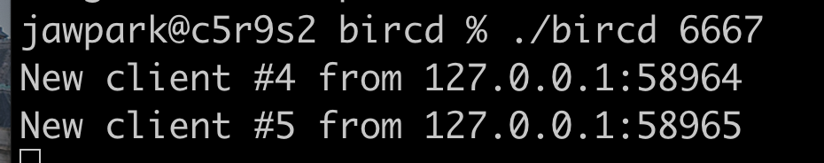
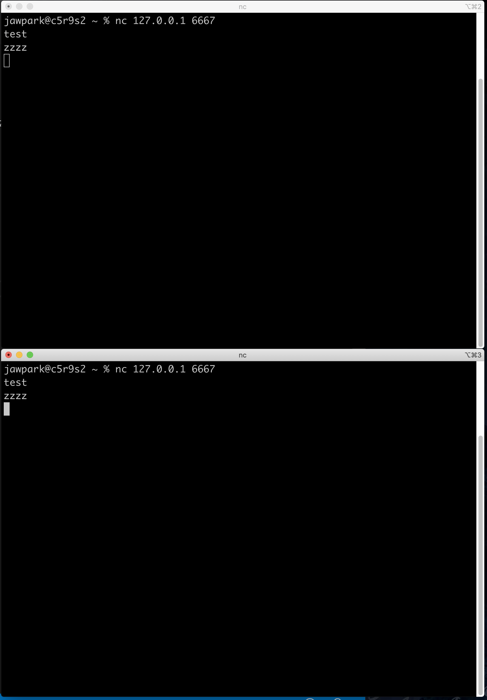

## 연결방법 사용.

```
#서버 역활 기본으로 주어지는 bircd.tar.gz 파일로 서버를 열수도 있음
nc -l 6667

#클라이언트 역할
nc 127.0.0.1 6667
```
위의 명령어는 1:1 기능만 되고 1:다 기능은 지원하지 않는 것인지 클라이언트 2개 일 경우 앞에 킨 것 만 메세지가 서버로 전송됨

아래 그림은 기본으로 주어진 bircd.tar.gz 파일로 실행했을 시 사진입니다.




