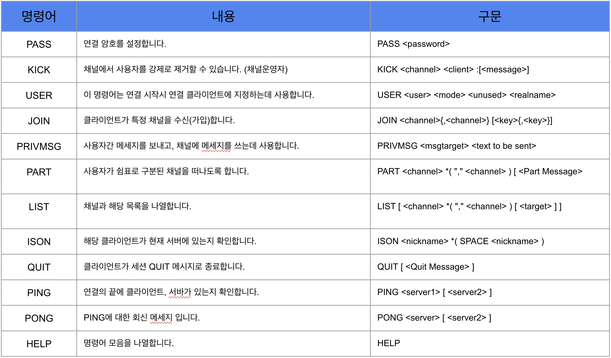
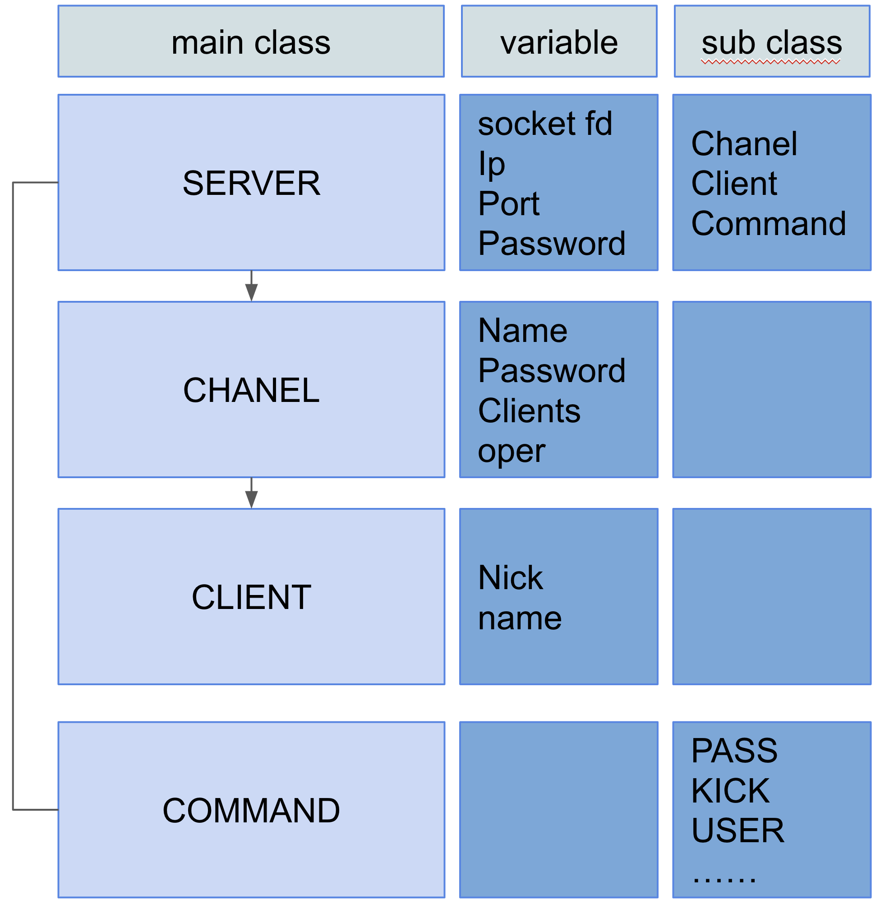

### 7월 22일 ft_irc 스터디

#### 선택한 명령어 모음


#### 클래스구조


#### Server Class
```
필요 헤더 
#include <sys/types.h>
#include <sys/event.h>

새로운 kernel event queue 생성
int fd = kqueue();

kevent 구조체 초기화
EV_SET(&kev, ident, filter, flags, fflags, data, udata);

int kevent(int kq, const struct kevent* list, int, struct kevent*, int, const struct timespec*);
첫번째 int 인 kq로 전달된 
list는 kevent 구조체의 배열로, changelist 배열에 저장된 kevent 구조체(이벤트)들은 kqueue에 등록된다. nchanges는 등록할 이벤트의 개수이다.
```
