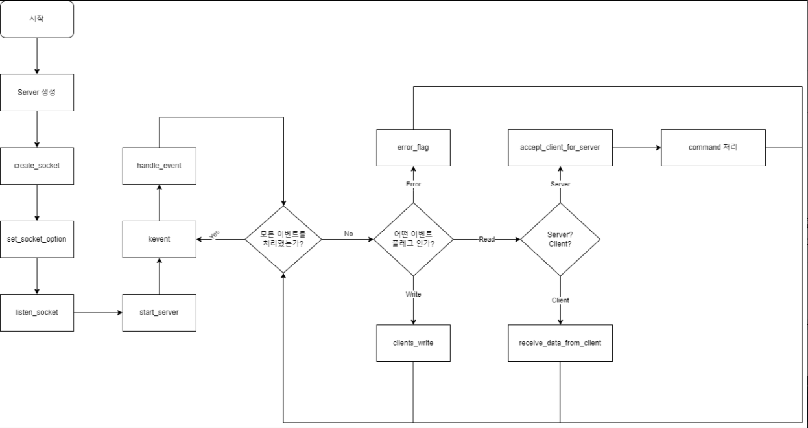

## 기본 조건

#### /r/n 포함 전송,출력문자 512문자
#### 닉네임, 채널명은 중복 불가능
#### 명령어는 기본 문법을 기준으로 한다.
#### 채널 앞에 #,& 붙는다.
#### 채널 운영자가 해당 채널에서 나갈때 다음 사용자에게 운영자 권한을 자동으로 넘겨지고 나간다.
#### 채널에서 채널운영자는 무조건 1명으로 정한다.
#### 메세지는 무조건 PRIVMSG 명령어를 입력 후 전송하도록 한다.
&nbsp;
&nbsp;
## 명령어 구조 정하기
|커맨드|결정사항|개발자|
|:---:|:---:|:---:|
|HELP|명령어 전체 및 사용방법 설명|**seonhjeo**|
|PASS|파라미터 1개(비번), 서버 비번과 비교를 통해 에러문 및 통과|**seonhjeo**|
|NICK|파라미터 1개(닉네임), 9글자 제한, 중복X,  숫자와 문자로만 작성, 화이트 스페이스X, **대소문자 확인 필요**|**seonhjeo**|
|USER|파라미터 4개(유저네임,모드,언유즈드,리얼네임) 모드는 0, 언유즈드는 '*'로 표시 리얼네임은 '**공백**'이   가능하고 첫번째가 ':' 시작한다. **파라미터의 제한을 확인필요**|**seonhjeo**|
|KICK|파라미터 3개(채널, 유저, 메세지), 채널운영자만 가능|**seonhjeo**|
|JOIN|파라미터 2개(채널명, PW), PW없는 경우도 있으며 있을 시 입력해야 채널 가입 가능|**byeukim**|
|PRIVMSG|파라미터 2개(채널 or 사용자, 메세지), 메세지 경우 ""으로 등록해야 메세지 보내는 것 가능|**byeukim**|
|PART|파라미터 1개(채널), 채널을 자발적으로 나가는 경우|**byeukim**|
|LIST|파라미터 0개, 채널 리스트를 보여준다.|**byeukim**|
|ISON|파라미터 1개(사용자), 서버 접속상태 확인|**jawpark**|
|QUIT|파라미터 0개, 클라이언트 종료 = ctrl + c와 같음|**jawpark**|
|PING|파라미터 1개, 서버가 유저한테 보내는 메세지 정해진 시간마다 보내서   연결하고 있는지 확인 하기 위해 보낸다|**jawpark**|
|PONG|파라미터 1개, PING 뒤에 적인 파라미터를 똑같이 적어서 보내서 연결 하고 있다고   전달 정해진 시간 안에 안보내면 끊어진다|**jawpark**|   
   
   
&nbsp;
&nbsp;
### 서버 플로우 차트 이미지

